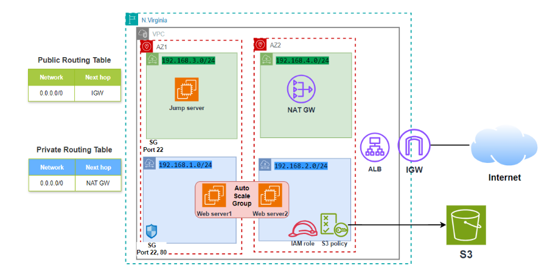

# Deploying-a-Highly-Available-Web-Application-on-AWS-using-terraform

## Objective
Deploy a highly available web application on AWS using Terraform, with an Application Load Balancer (ALB) distributing traffic across instances in an Auto Scaling Group (ASG). The deployment includes a bastion host for SSH access, S3 for backup storage, and secure network configurations using public and private subnets with a NAT gateway for outbound internet access from private instances.

## Infrastructure Setup

### 1. AWS Provider
- Configured for the `us-east-1` region to deploy the infrastructure.

### 2. VPC and Subnets
- A VPC with a CIDR block is created.
- Four subnets are defined:
  - Two public subnets for resources such as ALB and the bastion host.
  - Two private subnets for ASG instances.

### 3. Internet Gateway & NAT Gateway
- **Internet Gateway**: Enables public internet access for the public subnets.
- **NAT Gateway**: Provides outbound internet access for private instances via the NAT gateway in the public subnet.

### 4. Security Groups
- **ALB and Instance Security Group**: Allows HTTP traffic on port 80 and SSH access on port 22 from the internet.
- **Bastion Host Security Group**: Enables SSH access to manage private instances securely through the bastion host.

### 5. Application Load Balancer (ALB)
- The ALB listens on port 80 and forwards traffic to the ASG via a target group.
- Health checks are configured on the root path to ensure instance availability.

### 6. Auto Scaling Group (ASG)
- The ASG dynamically scales between 1 to 3 instances, ensuring high availability.
- Each instance runs a simple Python web server that serves a "Hello, World" page.
- ASG is configured using an EC2 Launch Configuration that installs necessary software (including Python).

### 7. Bastion Host
- A bastion host is deployed in the public subnet to provide secure SSH access to private EC2 instances.
- Users upload an SSH key to the bastion host to connect to private instances.

### 8. IAM Roles and S3 Integration
- EC2 instances are assigned an IAM role allowing access to the S3 bucket (`Cloudkode-s3`).
- Instances can read/write to the S3 bucket for backups or other file storage needs.

### 9. Private Subnet EC2 Access and Internet Connectivity
- SSH access to private instances is established through the bastion host.
- Private instances can connect to the internet via the NAT Gateway to download necessary software and updates.


## Architecture Overview




## Usage
1. Clone the repository.
2. Update the Terraform variables (such as SSH key, instance type, etc.).
3. Run the following Terraform commands:
   ```bash
   terraform init
   terraform plan
   terraform apply
